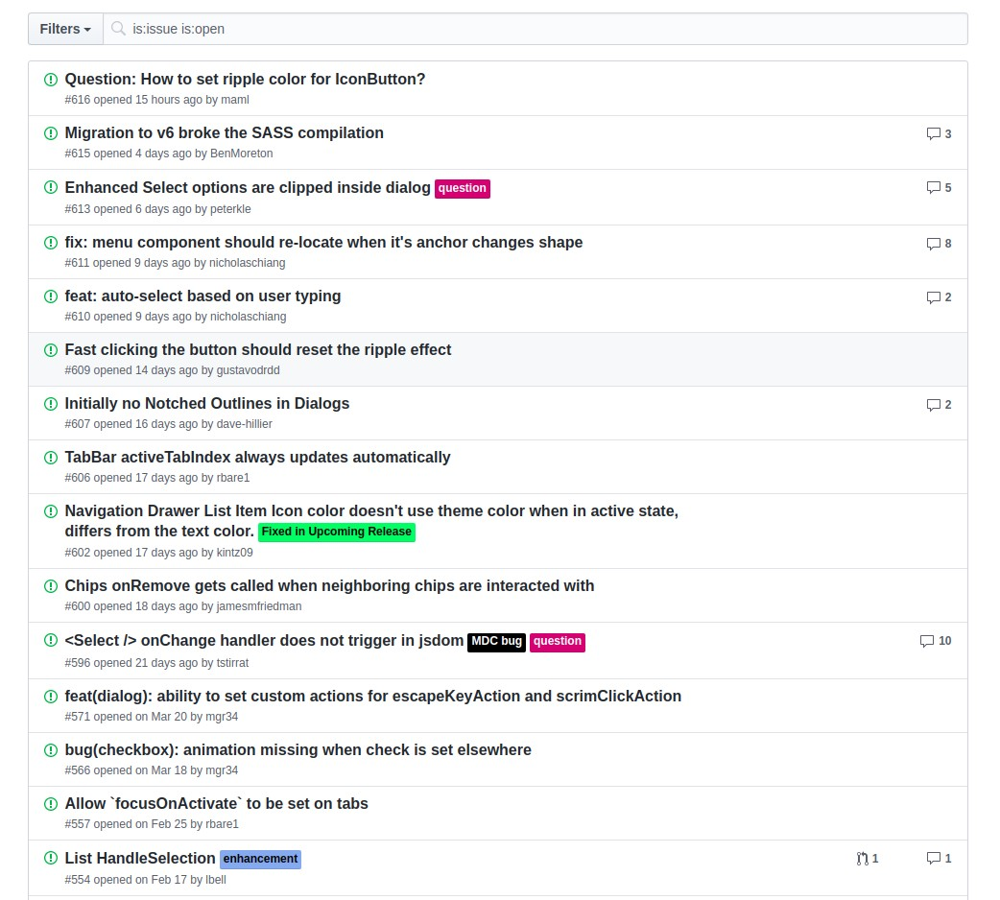

# React Rookie Party
Hi and welcome to React Rookie Party. We are here to have some fun and learn
new amazing things and concepts. You've probably familiarized yourself
with basic React ideas and already did some coding, didn't you? :) That's
great because now you're gonna face some real problem.

## The problem
One of our developers who actively runs his Open Source project on github
wants to have his own issues list. The first step is to make this list
identical to github's.

## How to develop
* use create-react-app tool
* on your github account create public repository called: github-issues
where you will keep your work
* rely on your experience and your intuition as well :)

## Requirements
First thing you're suppose to do is to obtain an API key from github. The
second one is to take a look at the UI.

Elements required to work:
* filters
* list

Above elements must work like their equivalents (we can filter list) and
styling must be identical. This is a first step to help our developer -
act as smart and fast as you can so he can spend more time drinking coffee
and playing LOL!

